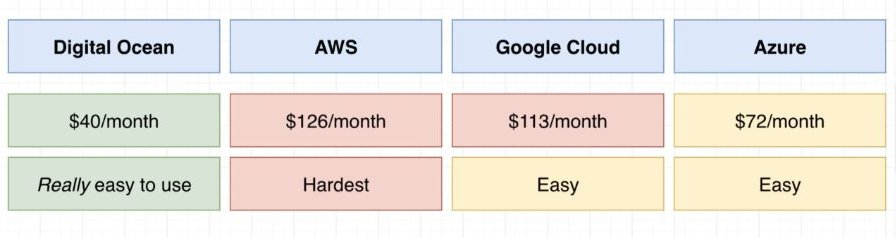

# DEPLOYMENT OPTIONS

PRVA STVAR KOJU TREBAMO DA URADIMO DA DEPLOY-UJEMO NAS APPLICATION JESTE **CHOOSING HOSTING PROVIDER I KREIRANJE NOVOG KUBERNATES CLUSTER-A**

TREBA DA POGLEDAMO NEKE RAZLICITE PROVIDER-E, DA IH EVALUATE-UJEMO, I EVENTUALLY CREATE-UJEMO CLUSTER ITSELF

ZA OVO CE MI BITI POTREBAN CREDIT CARD:

- TREBACE MI AROUND $1 ZA DOMAIN NAME, I AROUND $0.72 A DAY DA RUNN-UJEM CLUSTER

- ALI VEROVATNO MOGU NACI COUPON CODE DA PLATIM $0 A DAY ZA CLUSTER

# POSMATRACU SADA PROVIDER-E, I ZANIMACE ME TWO METRICS; KOLIKO SE MESECNO PLACAJU, I KOLIKO IH JE LAKO KORISTITI

ONO STO CEMO ASUME-OVATI ZA MESEC DANA KORISCENJA JESTE DA **IMAMO 3 INDIVIDUAL NODES (ODNOSNO 3 VIRTUAL MACHINE-A), A DA SVAKI OD NJIH IMA 2GB RMA I 1 CPU, PLUS SOME EXTRA STUFF**

NEKI OD PROVIDERA CE IMATI I EXTRA COSTS

TAKODJE ZA NEKE PROVIDERE NECE BITI MOGUCE DA DOBIJES 3 NODES SA 2GB RAMA I JEDNIM CPU-OM

ALI VODI RACUNA **DA CE OVO BITI ROUGH ESTIMATES**

DIGITAL OCEAN JE NAJJEFTINIJI, A AWS I GOOGLE CLOUS SU MNOGO SKUPLJI

AWS I GOOGLE CLUD TE CHARG-UJU SAMO Z KORISCENJE CLUSTER, BEZ DA IMAS VIRTUAL MACHINES INSIDE OF IT

KAD GOD RUNN-UJES KUBERNETES TI IMAS NESTO STA SE ZOVE MASTER NODE, ILI CONTROL PLAIN

TO JE PROCESS KOJE WATCH-UJE I EVALUATE-UJE TVOJ CLUSTER, I STARA SE DA CLUSTER RADI SCE CORRECTLY; DA MONITORY-UJE ALL THE DIFFERENT PODS, KREIRA PODS, KREIRA SERVICES, ALL THAT GOOD STUFF

E PA **AWS I GOOGLE CLOUD MAKE YOU PAY MONEY JUST FOR THAT CONTROL PLAIN; A U TOTALU TO IZNOSI 1 CENT PER HOUR; I COSTS NA TAJ PORASTU VEOMA BRZO**

TO BI BILO $72 MESECNO SAM OZA TAJ CONTROL PALIN; I TO JE MNOGO PARA I ZATO JE SO MUCH EXPENSIVE, DA BI KORISTIO AWS ILI GOOGLE CLOUD, ZA VERY SMALL, VERY SIMPLE KUBERNATES CLUSTER

AUTOR WORKSHOPA BI ZELEO DA KORISTI GOOGLE CLOUD, JER JE PRETTY DARN EASY TO USE, I UI JE FNTASTICAN; MONITORING JE VEOMA EASY, I TAKO DALJE, ALI JE A LITTLE BIT MORE ESPENSSIVE; A VEC SMO SE DOTAKLI GOOGLE CLOUD-A TOKOM OVOG WORKSHOP-A

DAKO DA CEMO GOOGLE CLOUD DA IZBACIMO KAO OPCIJU

AUTOR WOKSHOPA NIJE NIKAD KORISTIO AZURE, BAR ZA ZA KUBERNATES DEPLOYMENTS NIJE; TAKO DA GA NECU KORISTITI NI JA SADA

# KORISTICEMO DIGITAL OCEAN

ZA POCETNIKA SA KUBERNATES-OM, AWS JE NAJGORA OPCIJA

NA AWS-U IMA OGROMAN BROJ OPCIJA, SETUP STEPS, SETUP SCREENS, TONA UI-A, TONA SETTINGS-A, A POVRH SVEGA, SVE JE EXTREMNO TAJNOVITO, I DOKUMENTACIJA JE JADNA; I PORED TOGA UPLETENO JE SA NEKIM RESENJEM KOJE NUDE I KOJE SE ZOVE AWS FARGATE ,A I TO JE TESKO ZA RAZUMEVANJE

ZATO JE BOLJE ,NA POCETKU KORISTITI PROVIDER KOJI JE REALLY EASY TO USE, A KASNIJE U BUDUCNOSTI MOZES KORISTITI AWS

**S DIGITAL OCEAN-OM STVARI CE BITI LAKSE, CAK ON SOME LEVEL TI NECES REALIZE-OVATI DA MI RUNN-UJEMO ANYTHING WITH DIGITL OCEAN, OSECACES KAO DA JUST ACCESS-UJES KUBERNATES CLUSTER NA TVOM LOCALNOM MACHINE-U, TOLIKO CE LAKO BITI**

## JA SAM OTVORIO POTPUNO NOVI ACCOUNT NA DIGITAL OCEAN-U, KAKO BI KORISTIO ONIH 100$ ZA 60 DAYS

U SLEDECEM BRANCHU POZABAVICEMO SE KREIRNJEM HOSTED CLUSTERA NA DIGITAL OCEAN-U
