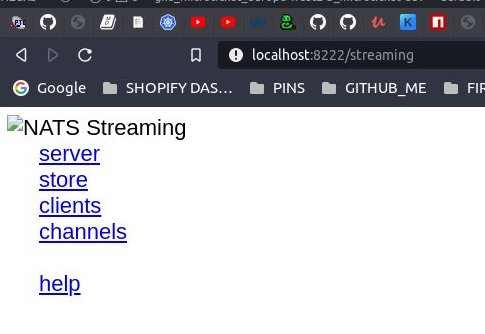

# CLIENT HEALTH CHECKS

DA TI PRVO PREDSTAVIM JEDAN PROBLEM 

DA TE PODSETIM

DAKLE IMAM DVA NASA SUBSCRIPTION, KOJA SU ACTIVE I ZA KOJE SAM DEFINISAO QUEUE GROUP, I ZA KOJE MORAM MANUELNO DA POTVRDIM AKNOWLEDMENT U message LISTENERU (VRATI SE U PREDHODNE BARANCHEVE AKO TI NIJE JASNO)

IMAM TAKODJE PUBLISHERA KOJI JE ACTIVE I KOJI SALJE MESSAGE ODMAH NAKON STO SE RUNN-UJE `publisher.ts` (PROSTO RECENO HARCODE-OVAO SAM T JSENDING DA MORA EXECUTABLE DA SE RESTARTUJE DA BI SE PUBLISH-OVAO EVENT) (VRATI SE U PREDHODNE BARANCHEVE AKO TI NIJE JASNO)

**UGASICU NAKRATTKO OBA LISTENERA**

SADA NEMA NIKOG DA LISTEN-UJE

ALI HAJDE DA BRZOM BRZINOM VRATIMO SADA ODMAH LISTENERE, DA IH OPET POKRENEMO

I ODMAH POSLE TOGA BRZOM BRZINOM

**RESTARTOVACU PUBLISHER SCRIPT DA BI OPET DOSLO DO PUBLISHINGA EVENTA**

PROBLEM JE U TOME STO NEKADA

**`TAJ EVENT NECE BITI PROSLEDJEN DO LISTENERA`**

SADA MOZES OPET DA RESTARTUJES PUBLISHERA ODNOSNO DA PUBLISH-UJES EVENT

DATA CE SE ODMAH STMAPTI U JEEDNOM OD LISTENER TERMINALA STO ZNACI DA JE ON TAJ EVENT USPESNO POSLAT

**ALI NAKON NEKOLIK ODESETINA SEKUNDI, JEDAN TERMINAL JEDNOG LISTENERA CE STAMPATI KAO REZULTAT ONOGG EVENT KOJI JE POSLAT KADA U SVI LISTENERI BILI DOWN**

STO ZNACI DA SE EVENT SA VECIM REDNIM BROJEM REGISTROVAO PRE ONOGA SA MANJIM REDNIM BROJEM

**DAKLE PROBLEM JE GUBITAK EVENT, KOJ ISE SOMETIMES NE REGISTRUJE U LISTENERU, KADA SE DOGODI UNISTAVANJE CLIENT I POSTAVLJANJE NOVOG CLIENT**

JER TI TO ESSENTIALLY RADIS KADA RESTARTUJES POMENUTI SCRIPT, UNISTAVAS JEDNOG LISTENERA I CONNECTUJES DRUGOG NA NATS STREAMING SERVER

# DA BI VIDEO ZASTO SE OVO DESAVA TI MORS MALO DA DIGG-UJES INSIDE NATS STREAMING SERVER

KADA SA NATS STREAMING SERVER INSTATICIZIRAO U POD U TVOM CLUSTERU, TI SI ZA NJEGA ZADAO DVA PORTA

EVO POGLEDAJ

- `cat infra/k8s/nats-depl.yaml`

```yaml
# ...
# OVO TI JE DDEO KONFIGURACIJE ZA CLUSTER IP
spec:
  selector:
    app: nats
  ports:
    # DODAO SI JEDAN PORT
    # TO JE PORT KOJ ISI EXPOSE-OVAO DA BI MOGAO
    # DA SE KONEKTUJES SA CLIENTIMA KOJI SU NA MOM LOKALNOM RACUNARU
    - name: client
      protocol: TCP
      port: 4222
      targetPort: 4222
      # ALI TU JE I DRUGI PORT, A KO STO VIDIS DAO SI MU IIME
      # MONITORING
    - name: monitoring
      protocol: TCP
      port: 8222

```

# MOZEMO DA ACCESS-UJEMO NATS STREAMING SERVIR NA MONITORING PORT-U I DOBICEMO ODATLE A LOT OF DIFFRENT INFORMATIONS FROM ALL SUBSCRIPTIONS WE CREATED, FROM ALL DIFFERENT CLIENT; MOZMO ACCESS-OVATI STATISTICS AND STUFF LIKE THAT

OTVORI NOVI TERMINAL

- `kubectl get pods`

```zsh
NAME                                  READY   STATUS    RESTARTS   AGE
auth-depl-865bdcff84-zq5c8            1/1     Running   0          24h
auth-mongo-depl-fff5dcdd9-lhwz7       1/1     Running   0          24h
client-depl-68d8f8cbd5-wpcl5          1/1     Running   0          24h
nats-depl-f878fb4f9-k6fgq             1/1     Running   0          24h
tickets-depl-6b9c6b485c-lsvgq         1/1     Running   0          24h
tickets-mongo-depl-8456f7b84c-8bbzl   1/1     Running   0          24h
```

- `kubectl port-forward nats-depl-f878fb4f9-k6fgq 8222:8222`

**TI SADA MOZES OTVORITI BROWSER I UKUCATI**

`http://localhost:8222/streaming`



DAKLE U PITANJU JE NATS STREAMING SERVER MONITORING PAGE

KLIKCI I GLEDAJ RZLICITI STATS ABOUT OUR STREAMING SERVER

POSTO POSMATRAS JSON DATA SKINI NEKI CHROME EXTENSSION DA TI LEPO FORMATIRA TO, MEDJUTIM JA SAM NA BRAVE BROWSERU I ON TO LEPO FORMATIRA

NAJVAZNIJE STO MOZES VIDETI SU

**clients**:

```json
{
  "cluster_id": "microticket",
  "server_id": "gJdbZHGPGN7jortjoENBVc",
  "now": "2021-04-23T13:21:13.916042283Z",
  "offset": 0,
  "limit": 1024,
  "count": 3,
  "total": 3,
  "clients": [
    {
      "id": "5ea96532",
      "hb_inbox": "_INBOX.LAF6FLRAX9NIWYZANC2FQA"
    },
    {
      "id": "abc",
      "hb_inbox": "_INBOX.CWUTWK0FJWKXKLSXAQB9G6"
    },
    {
      "id": "c343ebfa",
      "hb_inbox": "_INBOX.HWBBS0JJKCMQ2ECODTFKZ7"
    }
  ]
}
```

LISTET TI JE SVAKI CONNECTED CLIENT TO NATS STREAMING SERVER

SECAS SE DA SI PODESIO `"abc"` CLIENT ID ZA PUBLISHERA, DOK SI ZA LISTENERA TO RANDOMIZO-OVAO; IMAS DVA LISTENERA ("5ea96532" I
"c343ebfa")

**chanells**:

```json
{
  "cluster_id": "microticket",
  "server_id": "gJdbZHGPGN7jortjoENBVc",
  "now": "2021-04-23T13:53:19.655122042Z",
  "offset": 0,
  "limit": 1024,
  "count": 1,
  "total": 1,
  "names": [
    "ticket:created"
  ]
}
```

KAO STO VIDIS IMAS LISTIU SVIH AKTIVNIH KANALA ZA NATS STREEAMING SERVER

IMAMO SAMO JEDAN "ticket:created"

## POSTOJI JOS INFORMACIJA KOJE MOZES DA EXTRACTUJES, A VEZANE SU ZA CHANNNEL, ALI NIJE WELL DOCUMENTED

MORACES DA DODAS QUERY STRING

`http://localhost:8222/streaming/channelsz?subs=1`

EVO KAKAV INFO IMAS TU

```json
{
  "cluster_id": "microticket",
  "server_id": "gJdbZHGPGN7jortjoENBVc",
  "now": "2021-04-23T13:57:17.79136232Z",
  "offset": 0,
  "limit": 1024,
  "count": 1,
  "total": 1,
  "channels": [
    {
      "name": "ticket:created",
      "msgs": 30,
      "bytes": 2130,
      "first_seq": 1,
      "last_seq": 30,
      "subscriptions": [
        {
          "client_id": "c343ebfa",
          "inbox": "_INBOX.HWBBS0JJKCMQ2ECODTFL5L",
          "ack_inbox": "_INBOX.gJdbZHGPGN7jortjoENCQu",
          "queue_name": "orders-microservice-queue-group",
          "is_durable": false,
          "is_offline": false,
          "max_inflight": 16384,
          "ack_wait": 30,
          "last_sent": 0,
          "pending_count": 0,
          "is_stalled": false
        },
        {
          "client_id": "5ea96532",
          "inbox": "_INBOX.LAF6FLRAX9NIWYZANC2GN7",
          "ack_inbox": "_INBOX.gJdbZHGPGN7jortjoENCPi",
          "queue_name": "orders-microservice-queue-group",
          "is_durable": false,
          "is_offline": false,
          "max_inflight": 16384,
          "ack_wait": 30,
          "last_sent": 30,
          "pending_count": 0,
          "is_stalled": false
        }
      ]
    }
  ]
}
```

GORE JE KAO STO VIDIS INFO O JEDINO CHANNEL0U KOJI IMAS; `"ticket:created"`

VIIS DA IMAS TWO SUBSCRIPTIONS ZA TAJ CHANNEL, I VIDIS DA ONI KORISTE ISTI QUEUE GROUP KOJI SI PODESIO: "orders-microservice-queue-group"

CAK VIDIS I `ack_wait` PROPERTI KOJI IZNOSI 30; TO ZNACI AKNOWLEDGMENT OD 30 SEKUNDI

POSTOJI I DRUGI INFO KOJI MOZES FIGURATE-OVATI ON YOUR OWN IN YOUR SPARE TIME

# SADA POSMATRAJUCI BAS POMENUTI DATA, MOZES SHVATITI STA SE DESAVALO U SLUCAJU ONOG PROBLEMA ZA KOJI SAM REKAO DA SE JAVLJA, A KOJI SAM OBZNANIO NA POCETKU BRANCH-A

POKUSAJ DA RESTRATUJES JEDAN LISTENER, I ONDA RELOADUJ PAGE: `http://localhost:8222/streaming/channelsz?subs=1`

EVO KAKAV DATA VIDIS

```json
{
  "cluster_id": "microticket",
  "server_id": "gJdbZHGPGN7jortjoENBVc",
  "now": "2021-04-23T14:08:52.584974339Z",
  "offset": 0,
  "limit": 1024,
  "count": 1,
  "total": 1,
  "channels": [
    {
      "name": "ticket:created",
      "msgs": 30,
      "bytes": 2130,
      "first_seq": 1,
      "last_seq": 30,
      "subscriptions": [
        {
          "client_id": "c343ebfa",
          "inbox": "_INBOX.HWBBS0JJKCMQ2ECODTFL5L",
          "ack_inbox": "_INBOX.gJdbZHGPGN7jortjoENCQu",
          "queue_name": "orders-microservice-queue-group",
          "is_durable": false,
          "is_offline": false,
          "max_inflight": 16384,
          "ack_wait": 30,
          "last_sent": 0,
          "pending_count": 0,
          "is_stalled": false
        },
        {
          "client_id": "5ea96532",
          "inbox": "_INBOX.LAF6FLRAX9NIWYZANC2GN7",
          "ack_inbox": "_INBOX.gJdbZHGPGN7jortjoENCPi",
          "queue_name": "orders-microservice-queue-group",
          "is_durable": false,
          "is_offline": false,
          "max_inflight": 16384,
          "ack_wait": 30,
          "last_sent": 30,
          "pending_count": 0,
          "is_stalled": false
        },
        {
          "client_id": "6bcbd044",
          "inbox": "_INBOX.S8UPHTA8YEQDQCWVRYMTB3",
          "ack_inbox": "_INBOX.gJdbZHGPGN7jortjoENCS6",
          "queue_name": "orders-microservice-queue-group",
          "is_durable": false,
          "is_offline": false,
          "max_inflight": 16384,
          "ack_wait": 30,
          "last_sent": 0,
          "pending_count": 0,
          "is_stalled": false
        }
      ]
    }
  ]
}
```

**KAO STO VIDIS DOBIO SI TRECEG LISTENER-A**

STO JE CUDNO, JER ZNAS DA BI TREBAL ODA IMAS DVA JER TI SI SAMO JEDNOG RESTARTOVAO

**KADA SI GA UGASIO, NODE STREAMING SERVER JE POMISLIO DA IMAS TEMPORARY ZASTOJ U KONEKCIJI**

I TU CE CEKATI DOK NE SHVATI DA SE TA KONEKCIJA NECE VRATITI I SUBSCRIPTIO NCE BITI REMOVED

EVO SADA RELOAD-UJ

```json
{
  "cluster_id": "microticket",
  "server_id": "gJdbZHGPGN7jortjoENBVc",
  "now": "2021-04-23T14:11:51.4955567Z",
  "offset": 0,
  "limit": 1024,
  "count": 1,
  "total": 1,
  "channels": [
    {
      "name": "ticket:created",
      "msgs": 30,
      "bytes": 2130,
      "first_seq": 1,
      "last_seq": 30,
      "subscriptions": [
        {
          "client_id": "c343ebfa",
          "inbox": "_INBOX.HWBBS0JJKCMQ2ECODTFL5L",
          "ack_inbox": "_INBOX.gJdbZHGPGN7jortjoENCQu",
          "queue_name": "orders-microservice-queue-group",
          "is_durable": false,
          "is_offline": false,
          "max_inflight": 16384,
          "ack_wait": 30,
          "last_sent": 30,
          "pending_count": 0,
          "is_stalled": false
        },
        {
          "client_id": "6bcbd044",
          "inbox": "_INBOX.S8UPHTA8YEQDQCWVRYMTB3",
          "ack_inbox": "_INBOX.gJdbZHGPGN7jortjoENCS6",
          "queue_name": "orders-microservice-queue-group",
          "is_durable": false,
          "is_offline": false,
          "max_inflight": 16384,
          "ack_wait": 30,
          "last_sent": 0,
          "pending_count": 0,
          "is_stalled": false
        }
      ]
    }
  ]
}
```

I JESTE, REMOVED JE JER IMAS SAM ODVA OBJEKTA, U ORNJEM NIZU

CEKLO SE 30 SEKUNDI DA SE T KONEKCIJA TAKORECI OZNACI KAO NEPOSTOJECA

ZATO SI VIDJAO SOME MESSAGES TEMPORARRY LOST

**MEDJUTIM OVAJ PROBLEM NIJE SUPER DESIRABLE**

# TI SI USTVARI PODESIO U CONFIGU ODREDJENA RESNJA ZA OVAJ PROVLEM, ODREDJEN HEALTH CHECKS

```yaml
apiVersion: apps/v1
kind: Deployment
metadata:
  name: nats-depl
spec:
  replicas: 1
  selector:
    matchLabels:
      app: nats
  template:
    metadata:
      labels:
        app: nats
    spec:
      containers:
      - name: nats
        image: nats-streaming:0.17.0
        args: [
          #
          '-p',
          '4222',
          #
          '-m',
          '8222',
          # OVO JE HEARTBEAT REQUEST KOJI CE SE SLATI SVAKIH 
          # PET SEKUNDI DO CLIENT-A
          '-hbi',
          '5s',
          # OVO JE VREME KOJE SVAKI CLIENT IMA DA RESPOND-UJE
          '-hbt',
          '5s',
          # A OVO JE NUMBER OF TIMES KOJ ISVAKI CLIENT MOZE FAIL-OVATI
          # PRE NEGO STO NATS SERVER ASSUMU-JE DA JE CONNECTION 
          # DEAD AND GONE
          '-hbf',
          '2',
          #
          '-SD',
          #
          '-cid',
          'microticket'
        ]
---
apiVersion: v1
kind: Service
metadata:
  name: nats-srv
spec:
  selector:
    app: nats
  ports:
    - name: client
      protocol: TCP
      port: 4222
      targetPort: 4222
    - name: monitoring
      protocol: TCP
      port: 8222
```

DAKLE TWICE IN THE ROW SE CEKA DA REQUEST FAIL-UJE

ZATO SE ONO DESAVALO

## ALI MORA DA POSTOJI NACIN, KOJI KADA SE KAZE DA JE CLIENT DEAD I DA NE RECEIVE-UJE MESSAGES DA SE NE POKUSAVA SLANJE NA TAJ CLIENT

A TO CU POKAZATI U SLEDECEM BRANCH-U
