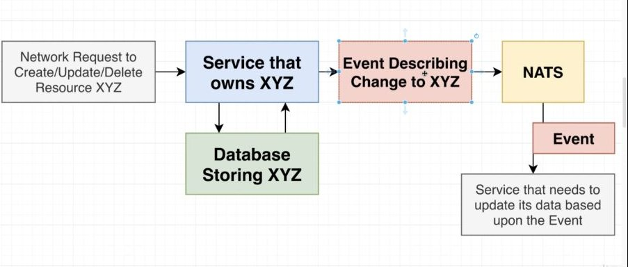

# tickets MICROSERVICE CONCURRENCY OVERVIEW

U PROSLOM BRANCH-U SAM SPOMENUO `LAST TRANSACTION` THING

TO CE RADIDTI SIMILARLY I INSIDE MOJE microticket APLIKACIJE

TACNIJE TO CU URADITI U MOM tickets MICROSERVICE-U

# SADA CEMO VIZUUALIZOVITI IN OUR MINDS AN EXAMPLE OF HOW THIS IS GOING TO WORK

BOLJE JE DA POKAZEM OVAJ DIAGRAM, KOJIM JE UOPSTENO PRIKAZANO STA CEMO

DA KAZEM, DA U SLUCAJU MOG APP, DRUGI MICROSERVICE, KOJI POSEBNO BRINE O `price` FIELD-U RESURSA tickets MICROSERVICE, JESTE MICROSERVICE orders

orders MICROSERVICE CE MORATI ZNATI price OF EVRY TICKET, I MORACE ZNATI ZA UPDATING TOG price-A

ZA tickets MICROSERVICE, SALJU SE REQUESTS, KOJIMA SE KRIRA ILI UPDATE-UJE TICKET (NA NJIH SADA OBRCAM PAZNJU, A POSTOJE A MOGUCE JE I CITATI SPECIFIC TICKET BY ID ILI GETT-OVATI ALL TICKET, MEDJUTIM MENE SADA ZNAIM CRETION I UPDATING)

D IMAGINE-UJEM STA SE DESAVA KADA SALJEM TE REQUESTS ZA CRETION, I ZA UPDATING

**NA PRIMER SEND-OVAO SAM REQUEST KOJI KREIRA TICKET SA price-OM 10$**

TO CE MICROSERVICE tickets PROCESS-OVATI I STORE-OVATI TICKET DOKUMENT U DATBASE-U

FIELD-OVI KOJI ME TRENUTNO ZANIMAJU IZMEDJU OSTALIH FIELD-OVA TICET DOKUMENTA SU: ticket `id`, `price`, `version`

**`version` CE BITI NESTO POPUT ONOG STO SAM U PROSLOM BRANCH-U NAZVAO `last transaction`**

ZADALI SMO `1` ZA `version` TOG KREIRANOG TICKET DOKUMENTA

**SADA tickets MICROSERVICE PUBLISH-UJE EVENT DO NATS STREAMING SERVER-A**

EVENT CE SE SLATI NA KANAL "`ticket:created`"; A PORED TOGA CE IMATI DATA: `{id, price: 10, version: 1}`

NATS CE TO PROSLEDITI ONOM MICROSERVICE-U KOJI JE SUBSCRIBED NA POMENUTI KANAL

TO CE BITI JEDINO `orders` MICROSERVICE, KOJI MOZE BITI SCALED HORIZONTALI, TAKO DA IMAS DVE INSTANCE TOG MICROSERVICE-A

**ALI ZAMISLI DA JE, CAK I PRE TOGA NEGO STO JE `ticket` MICROSERVICE, EMITOVAO TAJ EVENT, TAKODJE DOBIO JOS NEKOLIKO REQUEST-OVA**

RECIMO DA JE USER INSTANTNO KRENUO DA PRAVI DVA ADDITIONAL REQUESTA, JEDAN PA DRUGI NARAVNO, ALI DA JE ZELEO DA PROMENI PRICE TOG TICKETA

NA PRIMER HTEO JE DA POVECA PRICE NA 50, I POSLAO TAJ REQUEST

I REKAO JE ZASTO DA NE I 100, PA JE POSLAO I TA JREQUEST

***

ticket MICROSERVICE CE CE PROCESS-OVATI CHANGE, PROMENICE price TO 50, ALI TREBA DA SE PROMENI I `version` FIELD; **ODNOSNO `version` TREBA DA BUDE INCREMENTED ZA 1, TAKO DA CE BITI 1 + 1 = 2**

I KADA SE TO URADI SALJE SE OPET EVENT ALI ZA `"ticket:updated"` CHANNEL, I TAJ EVENT CE IMATI DATA: `{id, price: 50, version: 2}`

ALI REKLI SMO DA SMO POSLALI I DRUGI REQUEST

ticket MICROSERVICE CE CE PROCESS-OVATI CHANGE, PROMENICE price TO 100, ALI TREBA DA SE PROMENI I `version` FIELD; **ODNOSNO `version` TREBA DA BUDE INCREMENTED ZA 1, TAKO DA CE BITI 2 + 1 = 3**

I KADA SE TO URADI SALJE SE OPET EVENT ALI ZA `"ticket:updated"` CHANNEL, I TAJ EVENT CE IMATI DATA: `{id, price: 50, version: 3}`
